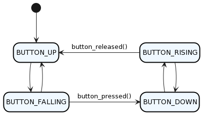

# Práctica 04

## Objetivo
Implementar una MEF para trabajar con anti-rebotes por software. 

## Punto 1
Crear un nuevo proyecto como copia del proyecto realizado para la [práctica 03](https://github.com/lmsoria/cese-pdm-workspace/tree/main/practica-03).

Implementar una MEF anti-rebote que permita leer el estado del pulsador de la placa NUCLEO-F413ZH y generar acciones o eventos ante un flanco descendente o ascendente, de acuerdo al siguiente diagrama:



El estado inicial de la MEF debe ser `BUTTON_UP`.

En `API_delay.c` se debe ubicar la implementación de todas las funciones.

Implementar dentro de `main.c`, las funciones:

```
void debounceFSM_init();    // debe cargar el estado inicial
void debounceFSM_update();	// debe leer las entradas, resolver la lógica de
                            // transición de estados y actualizar las salidas
void buttonPressed();       // debe invertir el estado del LED1
void buttonReleased();      // debe invertir el estado del LED3 
```

El tiempo de anti-rebote debe ser de 40 ms con un retardo no bloqueante como los implementados en la práctica 03.

La función `debounceFSM_update()` debe llamarse periódicamente.

```
typedef enum {
    BUTTON_UP,
    BUTTON_FALLING,
    BUTTON_DOWN,
    BUTTON_RAISING,
} debounceState_t
```

## Punto 2
Crear un nuevo proyecto como copia del proyecto con la implementación del [punto 1 de la práctica 04](https://github.com/lmsoria/cese-pdm-workspace/tree/main/practica-04-parte-1).

Implementar un módulo de software en un archivos fuente `API_debounce.c` con su correspondiente archivo de cabecera `API_debounce.h` y ubicarlos en el proyecto dentro de  las carpetas `/drivers/API/src` y `/drivers/API/inc`, respectivamente.

En API_debounce.h`` se deben ubicar los prototipos de las funciones públicas y las declaraciones:
```
void debounceFSM_init();
void debounceFSM_update();

/* La función readKey debe leer una variable interna del módulo y devolver true o false si la tecla fue presionada.  Si devuelve true, debe resetear (poner en false) el estado de la variable.*/
bool_t readKey();

```

En `API_debounce.c` se deben ubicar las declaraciones privadas, los prototipos de las funciones privadas y la implementación de todas las funciones del módulo, privadas y públicas.

La declaración de `debounceState_t` debe ser privada en el archivo .c y la variable de estado de tipo `debounceState_t` debe ser global privada (con `static`).

Declarar una variable tipo `bool_t` global privada que se ponga en `true` cuando ocurre un flanco descendente y se ponga en false cuando se llame a la función `readKey()`.

Implementar un programa que cambie la frecuencia de toggleo del LED2 entre 100 ms y 500 ms cada vez que se presione la tecla. El programa debe usar las funciones anti-rebote del módulo `API_debounce` y los retardos no bloqueantes del módulo `API_delay`.

## Notas del autor
Este directorio contiene la implementación del la parte 2. El proyecto fue creado teniendo como base la placa NUCLEO-F413ZH. No se agregó la librería de BSP. Es por ello que para controlar los LEDs se creó una estructura con la forma:
```
typedef struct
{
    GPIO_TypeDef* port;
    uint16_t pin;
} LedStruct;
```
Luego, los LEDs de la placa se declaran de la siguiente manera:
```
const LedStruct AVAILABLE_LEDS[LEDS_QTY] =
{
    {LD1_GPIO_Port, LD1_Pin},
    {LD2_GPIO_Port, LD2_Pin},
    {LD3_GPIO_Port, LD3_Pin}
};
```

(Buen momento para encapsular estos LEDs dentro de una `API_leds`, no?)

Por otro lado, para evitar duplicar la definicion de `bool_t` se optó por crear un header comun llamado `API_types.h` donde se encuentran todas las definiciones de tipos de datos custom.