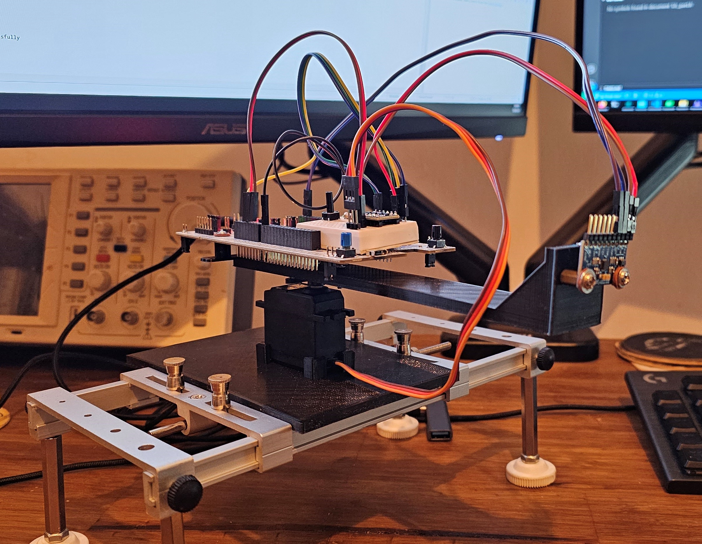
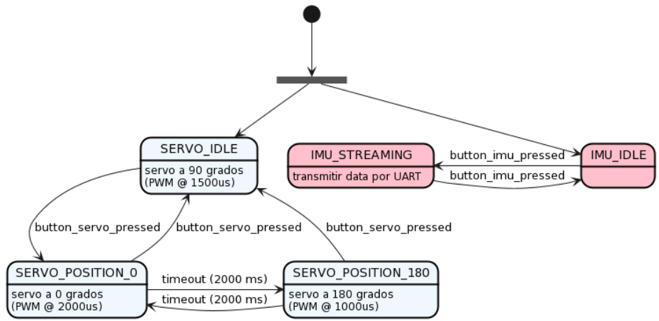

# Trabajo Práctico Final


* **Autor:** Ing. Leandro Soria
* **Asignaturas:** Programación de Microcontroladores - Protocolos de Comunicación en Sistemas Embebidos.
* **Plataforma:** `NUCLEO-F413ZH`

## Objetivos
Se desea comprobar si es viable realizar la estima de posición de un objeto que rota respecto a un eje, y su ángulo de rotación esta restringido a 180 grados, utilizando únicamente una IMU (*Intertial Measurement Unit*).

Para ello, se decidió armar el *fixture* que se muestra en la fotografía, que consiste de los siguientes elementos clave:
* Un servo, controlado por PWM.
* Un módulo con un MPU-6500, que consiste en una IMU de 6 grados de libertad (6DOF), capaz de medir aceleración y rotación en los ejes X, Y y Z.
* El kit de desarrollo mencionado anteriormente.

Los objetivos del firmware a desarrollar son:
* Desarrollar un driver para inicializar, configurar y muestrear la MPU-6500, utilizando un puerto I2C.
* Desarrollar una API para poder inicializar y controlar un periférico de PWM del microcontrolador, de modo que opere con una frecuencia de 50Hz (frecuencia de operación del servo).
* Desarrollar una API para poder inicializar la UART en 115200, 8N1 y poder enviar tramas.
* Teniendo funcionales los items mencionados anteriormente, se espera que la aplicación principal pueda implementar las siguientes máquinas de estados finitos que definen los modos de operación del equipo:



### Descripción de los estados
* `SERVO_IDLE`: Posición de reposo del sistema. En este estado el PWM debe poseer un ancho de pulso de 1500 us.
* `SERVO_POSITION_0`: La varilla deberá encontrarse a 0 grados. En este estado el PWM debe poseer un ancho de pulso de 2000 us.
* `SERVO_POSITION_180`: La varilla deberá encontrarse a 180 grados. En este estado el PWM debe poseer un ancho de pulso de 1000 us.
* `IMU_IDLE`: en este estado se ignoran los datos leídos de la IMU.
* `IMU_STREAMING`: en este estado se debe transmitir la data recibida por la IMU por puerto serie, a un baudrate de 115200 baudios.


## Desarrollo del Driver del MPU-6500 (PCSE)
La implementación del mismo se encuentra en el directorio [`Drivers/MPU6500`](https://github.com/lmsoria/cese-pdm-workspace/tree/main/tp-final/Drivers/MPU6500). La comunicación es a través del protocolo I2C, y es necesario implementar la siguiente API:
```
I2CPortError i2c_port_init(const uint8_t slave_address);

I2CPortError i2c_port_read_bit(const uint8_t register_address, const uint8_t bit_number, uint8_t* const data);

I2CPortError i2c_port_read_bits(const uint8_t register_address, const uint8_t bit_start, const uint8_t length, uint8_t* const data);

I2CPortError i2c_port_read_byte(const uint8_t register_address, uint8_t* const data);

I2CPortError i2c_port_read_bytes(const uint8_t register_address, const uint8_t length, uint8_t* const data);

I2CPortError i2c_port_write_bit(const uint8_t register_address, const uint8_t bit_number, const uint8_t data);

I2CPortError i2c_port_write_bits(const uint8_t register_address, const uint8_t bit_start, const uint8_t length, const uint8_t data);

I2CPortError i2c_port_write_byte(const uint8_t register_address, uint8_t data);

I2CPortError i2c_port_write_bytes(const uint8_t register_address, const uint8_t length, uint8_t* const data);
```

En [`i2c_port.c`](https://github.com/lmsoria/cese-pdm-workspace/blob/main/tp-final/Drivers/MPU6500/src/i2c_port.c) se encuentra una implementación basada en la HAL ofrecida por el fabricante de STM32.

Después, para utilizar el dispositivo es necesario:
* Incluir `MPU6500.h`
* Crear una estructura de tipo `MPU6500_config_t` definiendo el modo de operación.
* Llamar a `MPU6500_init()` pasando la referencia a la configuración.
* Si se desea obtener las mediciones de aceleración, rotacion y/o temperatura es necesario llamar a `MPU6500_read_acceleration_raw()`, `MPU6500_read_rotation_raw()` y `MPU6500_read_temperature_raw()`, respectivamente.

## Desarrollo de las MEF
Las máquinas de estado de "alto nivel" se encuentran definidas dentro del directorio [`Services`](https://github.com/lmsoria/cese-pdm-workspace/tree/main/tp-final/Services).
Se encuentran dos archivos:
* `SVC_servo`: API que inicializa los drivers necesarios para controlar el servo (PWM) y actualiza su respectiva máquina de estados.
* `SVC_imu`: API que inicializa los drivers necesarios para leer los datos de la IMU y poder enviarlos por puerto serie, y tambien actualiza su respectiva máquina de estados.

Dado que ambas MEFs requieren detectar si sus respectivos pulsadores fueron apretados, declaran un handler que deberá ser "conectado" en `main.c` para reaccionar ante los eventos de la MEF de los pulsadores.

Esta modularización permite tener un `main.c` compacto, en el cual solo deben inicializarse ambos servicios y actualizar sus MEFs periódicamente:
```
int main(void)
{
    delay_t heatbeat_delay = {};

    delay_init(&heatbeat_delay, HEARTBEAT_PERIOD_MS);

    HAL_Init();
    SystemClock_Config();
    MX_GPIO_Init();
    MX_USB_DEVICE_Init();

    debounce_fsm_init(SERVO_BUTTON, &servo_button_fsm_handlers);
    debounce_fsm_init(USER_BUTTON, &streaming_button_fsm_handlers);

    svc_servo_init();
    svc_imu_init();

    while (1)
    {
        debounce_fsm_update();
        svc_servo_fsm_update();
        svc_imu_fsm_update();
        if(delay_read(&heatbeat_delay)) { led_toggle(HEARTBEAT_LED); }
    }
}
```
## Codificación de la trama enviada por UART
El MPU-6500 almacena las mediciones de aceleración y rotación en enteros signados de 16 bits (`int16_t`). Para maximizar el ancho de banda se propone empaquetar las mediciones junto a un `header` y un `footer` y enviar este paquete por puerto serie. La aplicación de PC deberá saber el formato de trama para poder decodificar el mensaje.

Se propone el siguiente empaquetamiento de mensajes (ver [`SVC_protocol.h`](https://github.com/lmsoria/cese-pdm-workspace/blob/main/tp-final/Services/inc/SVC_protocol.h)):
```
#define HEADER_MAGIC_WORD 0xaa
#define FOOTER_MAGIC_WORD 0x55

#pragma pack(push, 1)

/// @brief struct used as prefix for any transmitted message
typedef struct
{
    uint8_t magic_word; ///< Fixed-value character that will be used for recognizing
                        ///  the beginning of a frame during a transaction.
} ProtocolHeader;

/// @brief struct used as suffix for any transmitted message
typedef struct
{
    uint8_t magic_word; ///< Fixed-value character that will be used for recognizing
                        ///  the end of a frame during a transaction.
} ProtocolFooter;

/// @brief wrapper containing all the IMU measurements.
typedef struct
{
    int16_t accel_x;
    int16_t accel_y;
    int16_t accel_z;
    int16_t gyro_x;
    int16_t gyro_y;
    int16_t gyro_z;
} IMUMeasurement;

/// @brief Message sent through UART
typedef struct
{
    ProtocolHeader header;
    IMUMeasurement measurement;
    ProtocolFooter footer;
} IMUMeasurementReadyCommand;

#pragma pack(pop)
```

## Notas del autor
* El proyecto fue creado teniendo como base la placa NUCLEO-F413ZH.
* No se agregó la librería de BSP.
* Para el manejo de los LEDs de decidió crear una API básica que puede consultarse en [`drivers/API/inc/API_leds.h`](https://github.com/lmsoria/cese-pdm-workspace/blob/main/tp-final/Drivers/API/inc/API_leds.h)
* Para el manejo del botón se decidió crear una API básica que puede consultarse en [`drivers/API/inc/API_button.h`](https://github.com/lmsoria/cese-pdm-workspace/blob/main/tp-final/Drivers/API/inc/API_button.h)
* Para evitar duplicar la definicion de `bool_t` se optó por crear un header común llamado [`API_types.h`](https://github.com/lmsoria/cese-pdm-workspace/blob/main/tp-final/Drivers/API/inc/API_types.h) donde se encuentran todas las definiciones de tipos de datos custom.
* Se decidió modificar la forma de `debounce_fsm_init()` para que acepte un puntero a una estructura custom que a su vez contiene punteros a funciones: `typedef void (*button_callback_t)(void)`. De esta forma, desde `main.c` se pueden crear los handlers adecuados (y desacoplados de la lógica interna de la FSM) para procesar ambos eventos triggereados por la FSM.

## Links de Referencia
* [DS11581 - STM32F413xH Datasheet](https://www.st.com/resource/en/datasheet/stm32f413zh.pdf)
* [UM1725 - Description of STM32F4 HAL and low-layer drivers (PDF)](https://www.google.com/url?sa=t&rct=j&q=&esrc=s&source=web&cd=&ved=2ahUKEwio4pKV_ub_AhU2rZUCHVSeBiwQFnoECAsQAQ&url=https%3A%2F%2Fwww.st.com%2Fresource%2Fen%2Fuser_manual%2Fum1725-description-of-stm32f4-hal-and-lowlayer-drivers-stmicroelectronics.pdf&usg=AOvVaw21r2dLlr83WM6rfjwZ3NM-&opi=89978449)
* [MPU-6500 Datasheet](https://invensense.tdk.com/wp-content/uploads/2020/06/PS-MPU-6500A-01-v1.3.pdf)
* [MPU-6500 - Register Map and Descriptions](https://invensense.tdk.com/wp-content/uploads/2015/02/MPU-6500-Register-Map2.pdf)